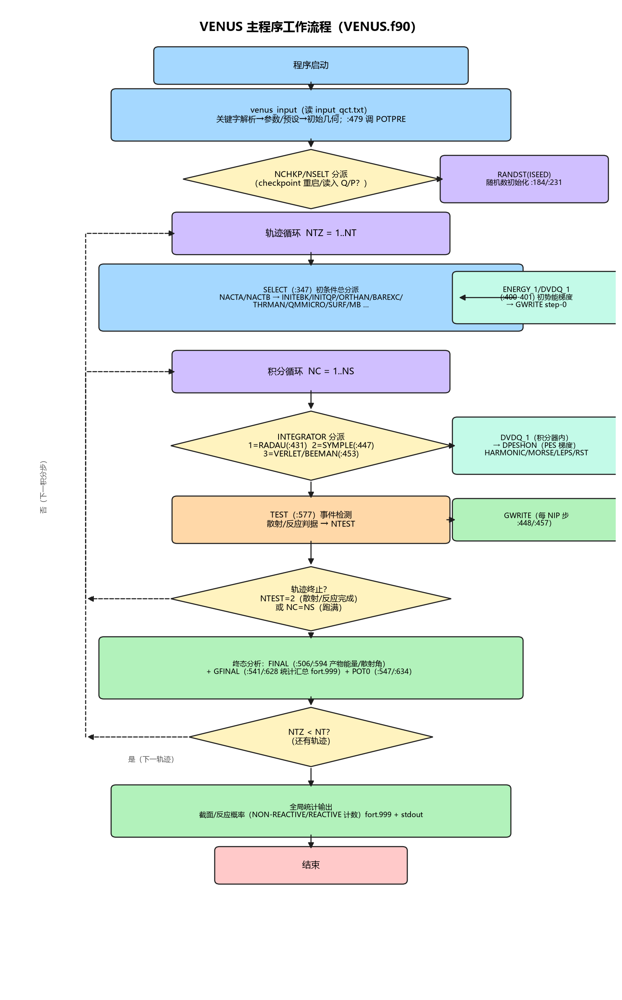

# VENUS2026

VENUS 化学动力学 Fortran 程序的最小可运行形态。基于 Hase 等 VENUS（2010）与
Bin Jiang fork（2016）的泛化工程，本仓库只保留**体系无关的 TEST 势构建**：
不依赖任何体系数据文件即可编译、运行、复现 `cases/` 中的全部示例。

## 程序结构

### 组成与目录布局

```
├── Makefile               # 唯一构建入口（Intel ifx + MKL）
├── VENUS.f90              # 主程序（初始化、轨迹循环、终态分析）
├── venus_params.f90       # 全部 PARAMETER 常数（单位换算 C1/C7 等）
├── venus_data.f90         # 全局轨迹状态模块（原 COMMON 块）
├── venus_input.f90        # 输入读取、关键字解析、初始坐标设置
├── input_parser.f90       # keyword=value 解析器
├── param_mapping.f90      # 字符串→整数关键字映射
├── presets.f90            # MODEL 预设
├── harmonic_sampling.f90  # 谐振子 Boltzmann 能量采样
├── ENERGY.f / DVDQ.f      # 能量/导数
├── src_VENUS/             # 引擎子程序库（60 文件，逐文件功能见下表）
├── src_TEST/              # TEST 势三件套 + POTPRE 接口
└── cases/                 # 16 个示例 case，各含 README.md + input_qct.txt
                           #   + results.txt（+验证图与入库轨迹）
```

### src_VENUS/ 引擎子程序库

| 文件 | 功能 |
|---|---|
| **初条件采样（SELECT 分派，NACTA/NACTB）** | |
| `SELECT.f90` | 初始条件选取总分派（NACTA/NACTB） |
| `HOMOQP.f90` | 双原子初始坐标与动量 |
| `INITEBK.f90` | EBK 量化初条件——固定振动/转动量子数 |
| `INITQP.f90` | 正则准周期初条件采样 |
| `ORTHAN.f90` | 象限（orthant）采样 |
| `BAREXC.f90` | 势垒激发——反应坐标动量选取 |
| `QMMICRO.f` | 量子微正则采样（QM-MICRO） |
| `MICROCI.f` | CI 量子微正则采样（CI-QM-MICRO） |
| `THRMAN.f` | 热布居采样——温度到振动/转动能 |
| `SURF.f` | 束流型/热型表面采样 |
| **简正模与局域模分析** | |
| `NMODE.f90` | 简正模分析驱动 |
| `FGMTRX.f` | 质量加权 Wilson F-G 矩阵构造 |
| `FMTRX.f` | 力常数矩阵构造 |
| `EIGN.f` | 矩阵对角化（Givens-Householder） |
| `EIGOUT.f` | 本征值/本征向量输出 |
| `ENMODE.f` | 简正模能量计算 |
| `LMODE.f` | 局域模键长选取（Miller 半经典） |
| `LMEXCT.f` | 局域模能量接受判据（Morse 振子） |
| `EBOND.f` | 局域模（Morse 振子）能量计算 |
| **旋转与转动** | |
| `ROTATE.f90` | 片段构型旋转 |
| `ROTATEX.f` | 绕质心欧拉角随机旋转子步骤（X 轴） |
| `ROTATEY.f` | 绕质心欧拉角随机旋转子步骤（Y 轴） |
| `ROTATEZ.f` | 绕质心欧拉角随机旋转子步骤（Z 轴） |
| `ROTATEJM.f` | (J,M) 态矢量模型旋转双原子 |
| `ROTATEJKM.f` | 对齐矢量至 Z 轴并旋转分子（J,K,M 制备） |
| `ArbitraryAxisRotation.f` | 绕任意轴旋转（rotaline） |
| `ROTN.f90` | 角动量/转动惯量张量/转动能计算 |
| `ROTEN.f90` | 转动能采样（Boltzmann + 拒绝） |
| `CENMAS.f90` | 去质心动量与质心坐标 |
| `ANGVEL.f` | 角速度扣除（去整体转动） |
| **积分器** | |
| `VERLET.f90` | 速度 Verlet 与 Beeman 积分器 |
| `SYMPLE.f` | 4/6/8 阶辛积分器（Schlier 参数） |
| `RADAU.f` | RADAU（RA15）积分器——定步/变步 |
| **势能与参考构型** | |
| `POTEN.f` | 旋转分子至质心系并求势能 |
| `POTENZ.f` | 反应物/产物参考构型设置（VZERO 基准） |
| **随机数** | |
| `RANDST.f` | 随机数生成器初始化（Schwenke） |
| `RAND1.f` | 乘同余随机数生成器 |
| `RAND0.f` | 随机数序列取数 |
| `GAMA.f` | 整数阶 gamma 分布随机数 |
| `GASDEV.f` | 正态随机数（Box-Muller） |
| `PROBJ.f90` | 拒绝采样判据 |
| `JMAXCALC.f` | 转动分布 J 上限计算（温度与转动惯量） |
| `DENQ.f` | 量子态密度计算（EBK 能级） |
| `GLPAR.f` | Gauss-Legendre 求积参数 |
| `VOLPSCONE.f` | CI 微正则相空间锥体积 |
| **恒温与热浴** | |
| `THERMO.f` | 速度重标度恒温器 |
| `THERMBATH.f` | 热浴速度标定 |
| `GLO.f90` | 广义 Langevin 浴（GLO 模型）；`GLO.f` 为遗留副本（构建用 .f90） |
| **终态分析与输出** | |
| `TEST.f` | 中间与终态事件检测（散射/反应判据） |
| `FINAL.f` | 产物能量与散射角计算 |
| `FINLNJ.f` | 产物双原子振动/转动量子数（作用量积分） |
| `GFINAL.f` | 轨迹终态分析汇总写入 |
| `GWRITE.f90` | 逐步轨迹诊断写出（fort 相空间与 stdout 统计） |
| `HIST.f90` | 碰撞结果直方图记录 |
| `PRINFO.f` | 采样信息打印 |
| `WEBOND.f` / `WLBOND.f` | 局域模能量统计累积（均值/方差/分箱） |
| `WENMOD.f` | 简正模能量均值/方差累积与分箱 |
| **工具** | |
| `CPUSEC.f` | CPU 计时 |
| `VFDATE.f` | 当前日期时间获取 |

### 主程序工作流程



主循环为双层结构（轨迹循环 NT × 积分循环 NS），主要子例程调用位置（行号）：
`venus_input.f90:479` POTPRE（PES 初始化）→ `VENUS.f90:347` SELECT（初条件分派）→
`:400-401` ENERGY_1/DVDQ_1（初势能/梯度）→ 积分器分派（`:431` RADAU / `:447` SYMPLE /
`:453` VERLET-BEEMAN，每步经 DVDQ_1 调 PES 的 DPESHON）→ `:577` TEST（事件检测）→
终态 FINAL（`:506/:594`）+ GFINAL（`:541/:628`）→ 全局统计。可编辑源图
`docs/venus_flow.excalidraw`。

### 构建与运行

```bash
make            # 单次 ifx 调用，产出 venus_test.e
make clean

cd cases/morse_bootstrap
../../venus_test.e
```

主输入文件名**硬编码**为运行目录下的 `input_qct.txt`（`venus_input.f90:191`，
不经 stdin）；`TASK=READ-QP` / `NORMAL-MODE` 的坐标与动量从 stdin 顺序读入
（例：`../../venus_test.e < coords_q.txt`）。每个 case 目录即一个可直接运行的
沙箱；要运行变体输入，先 `cp <变体> input_qct.txt`。

### TEST 势三件套

运行时由关键字 `TEST_PES` 选择，参数全部经输入文件给定（缺省取内置 H₂/H₃ 值）：

| `TEST_PES` | 形式 | 参数关键字 |
|---|---|---|
| `HARMONIC` | 每原子独立简谐阱 | `HARM_K`（eV/Ų，逐原子） |
| `MORSE` | 双原子 Morse | `MORSE_DE`（eV）、`MORSE_RE`（Å）、`MORSE_A`（Å⁻¹） |
| `LEPS` | 三原子 LEPS | `LEPS_DE`、`LEPS_RE`、`LEPS_A`、`LEPS_DELTA`（Sato Δ） |
| `RST` | C/Au(111) 成对 1D-NN 吸附势 + BVK 弹性板块 | `RST_WEIGHTS_FILE`、`RST_BVK_FILE`、`RST_SLAB_SOURCE`、`RST_ALAT`/`RST_NLAYERS`/`RST_NSIDE`（资源取自 `data/rst/`） |

势与梯度全部由 `src_TEST/test_potentials.f90` 解析给出；HARMONIC/MORSE/LEPS
不读取任何外部势文件（RST 例外：NN 权重与 BVK 参数读自 `data/rst/`，见
`cases/rst_beam_scattering`、`cases/rst_surface_md`）。仅经典动力学（`ELEC_METHOD=ADIABATIC`）；非绝热方法
（TDHF-FSSH/IESH/MDEF）的入口在本构建中为 **loud-stop 桩**——调用即打印明确
消息并 STOP，不会静默给出错误物理。

### 单位制

内部（code）单位制非原子单位，为混合制：

| 量 | 单位 |
|---|---|
| 长度 Q | Å |
| 质量 W | amu |
| 时间步 DT | 10 fs |
| 能量（code 单位） | amu·Å²/(10 fs)² |
| 动量 P | amu·Å/(10 fs)（P=W·v，P²/2W 为 code 能量） |

换算常数（`venus_params.f90`）：`C1`=0.04184（kcal/mol→code 能量）、
`C7`=0.063508（ℏ，code 单位）、23.0605（eV→kcal/mol）、
`C8`=1.987×10⁻³（k_B，kcal/mol/K）。输入文件中的能量一律 kcal/mol，
频率 cm⁻¹，时间步 DT 以 10 fs 为单位（DT=0.01 → 0.1 fs）。

### 主要输出文件

| 文件 | 内容 |
|---|---|
| stdout | 横幅、采样回显（CHOSEN EROTA/EVIBA、INTERNAL ENERGY 等）、终态分析 |
| `fort.1NNN` | 每轨迹逐步坐标/动量（NNN=1001+轨迹号） |
| `fort.88` | 束流几何（瞄准点 RX0/RY0 等，表面 case） |
| `fort.999` | 汇总统计与运行耗时 |

## 现代化改进对照

本仓库相对旧版 VENUS（Fortran 77 固定格式 + COMMON 块 + GOTO 网络）的
结构性现代化，以 `OLD VENUS VERSIONS/VENUS_TSH_HO2` 为参照，逐主题给出
"旧 → 新"实际代码摘录：COMMON 块 → 模块（运行时分配）、GOTO 网络 →
结构化命名循环、顺序 READ(5) 输入 → 关键字解析、固定格式 → 自由格式、
死代码移除。见 [docs/modernization.md](docs/modernization.md)。

## 扩展

接入自定义势能面、初始条件采样方法、积分器或非绝热电子方法，见
[docs/EXTENDING.md](docs/EXTENDING.md)——以 TEST 势三件套为活模板的
分步指南（含单位契约与验证注意事项）。

## 输入关键字与功能

输入格式：`KEYWORD=VALUE1, VALUE2, ...`，`#` 或 `!` 起注释，续行以 `,` 结尾。
字符串关键字大小写不敏感；旧整数关键字（`NSELT`/`NSURF`/`NACTA`/`NACTB`/
`CALTYP`/`INTEGRATOR`+`LLL`）在字符串关键字缺省时作回退。

### 计算任务 `TASK`

| 值 | 功能 | 示例 |
|---|---|---|
| `TRAJECTORY`（2） | 标准轨迹计算 | 多数 cases |
| `READ-QP`（0） | 从 stdin 读任意几何+动量起点 | — |
| `BARRIER`（3） | 势垒鞍点起始（配 `NBAR`/`EBAR`/`TBAR`） | 已移除 case（低频功能，历史见 git log） |
| `PES-SCAN`（4） | 势能曲线扫描 | — |
| `NORMAL-MODE`（-1） | ⚠️ 已移除，读入即强制终止 | — |

### 预设 `MODEL`（自动填充行为参数，均可显式覆盖）

| 值 | NSURF | NACTA | NACTB | 适用场景 | 示例 |
|---|---|---|---|---|---|
| `GAS-PHASE` | 0 | 0 | 0 | 气相碰撞/孤立分子 | `cases/morse_bootstrap`、`cases/twobody_collision` |
| `RELAXED-SURFACE` | 1 | 5 | 0 | 松弛表面束流散射 | `cases/rst_beam_scattering`（RST 势 Au） |
| `RIGID-SURFACE` | 2 | 0 | 0 | 刚性表面束流散射 | `cases/rigid_surface` |
| `FULL-SURFACE` | 1 | 0 | 7 | 多原子表面板块 + MD 均衡 | `cases/rst_surface_md`（RST 势 Au） |

体系描述参数（`NATOMS`、`ATOM_MASSES`、`NATOMA`、`NATOMB`、`QZA_EQ`、`QZB_EQ`、
`BOXLX`、`BOXLY`、`SKEW`）不由预设设置，必须显式给定。`SURFACE_MODEL=NONE/
RELAXED/RIGID` 为 NSURF 的字符串别名；旧整数 `NSURF=2` 会被重映射为 RELAXED
（D1），刚性表面须用字符串关键字。

### 初条件采样 `INIT_SAMPLING_A` / `INIT_SAMPLING_B`

| 值 | 功能 | 示例 |
|---|---|---|
| `MB`（0） | Maxwell-Boltzmann；双原子配 `TRV_A<0` 走 EBK 固定 n,J | `cases/ebk_fixed_nj`、`cases/mb_thermal` |
| `ORTHANT`（1） | 正交采样：固定内能+对称陀螺 | 已移除 case（低频功能） |
| `MICROCANONICAL`（2） | 微正则简正模能量分配 | 已移除 case（低频功能） |
| `NORMAL-MODE`（3） | 固定简正模量子数 `ANQ_A` | `cases/fixed_normalmode_qnums` |
| `LOCAL-MODE`（4） | ⚠️ 已移除，关键字显式拒绝 | — |
| `BOLTZMANN-VIB`（5） | 玻尔兹曼振动（几何分布，`TVIB_A`） | `cases/boltzmann_vib` |
| `FIXED-ENERGY`（6） | 固定能量含反应坐标（`NBAR=3` 自动触发） | 已移除 case（低频功能） |
| `MD`（7，仅 B） | 表面 MD 恒温均衡（`THERMOTEMP`/`NSCALE`） | `cases/rst_surface_md` |
| `QM-MICRO`（8） | 量子微正则（态密度取态） | 已移除 case（低频功能） |
| `CI-QM-MICRO`（9） | ⚠️ 已移除，关键字显式拒绝 | — |

### 积分器 `INTEGRATOR`

| 值 | 阶数/状态 | 说明 |
|---|---|---|
| `VERLET`（推荐） | 2 阶 | 默认选择，漂移有界 |
| `BEEMAN` | 2 阶 | |
| `SYMPLECTIC-4` | 实际 2 阶 | 系数本身仅 2 阶 |
| `SYMPLECTIC-6` / `SYMPLECTIC-8` | 高阶 | 最小步长达机器精度平台 |
| `RADAU-FIXED` / `RADAU-ADAPTIVE` | 高阶 | 自适应为容差驱动 |
| `RK4` | ⚠️ 不可达 | 入口被 RADAU 拒绝 |

矩阵验证与漂移排序见 `cases/integrator_matrix`。

### 电子结构 `ELEC_METHOD`

| 值 | 状态 |
|---|---|
| `ADIABATIC`（-1） | 唯一可用（经典动力学） |
| `TDHF-FSSH` / `IESH` / `MDEF` | 本构建为 loud-stop 桩（不含非绝热模块的体系资产） |

### 常用运行控制参数

| 关键字 | 含义 |
|---|---|
| `NT` / `NS` / `DT` / `NIP` | 轨迹数 / 每轨迹步数 / 步长（10 fs）/ 输出间隔 |
| `ISEED` | 随机种子（非 0 固定；NSELT=2/3 下用户种子实际无效，序列由种子 1 决定） |
| `EREL` / `NREL` | 初始相对平动能（kcal/mol）/ 固定（1）或温度（0）模式 |
| `BMAX` / `THTA` / `CHI` / `NCHI` | 碰撞参数上限（Å）/ 入射角（度）/ 方位角 / 固定取向标志 |
| `ENMT_A` | 固定内能（kcal/mol，ORTHANT/MICROCANONICAL/FIXED-ENERGY/QM-MICRO） |
| `TRV_A` / `TROT_A` / `TVIB_A` | 振动/转动/振动温度（K） |
| `ANQ_A` / `AI_A` | 简正模量子数 / 双原子转动惯量（amu·Å²） |
| `NBAR` / `EBAR` / `TBAR` | BARRIER 反应坐标：采样方式 / 固定能 / 温度 |
| `THERMOTEMP` / `NSCALE` / `NEQUAL` | MD 恒温：温度（K）/ 重标间隔 / 均衡步 |
| `QZA_EQ` / `QZB_EQ` | A/B 片段平衡构型（Å，逐原子 x,y,z） |
